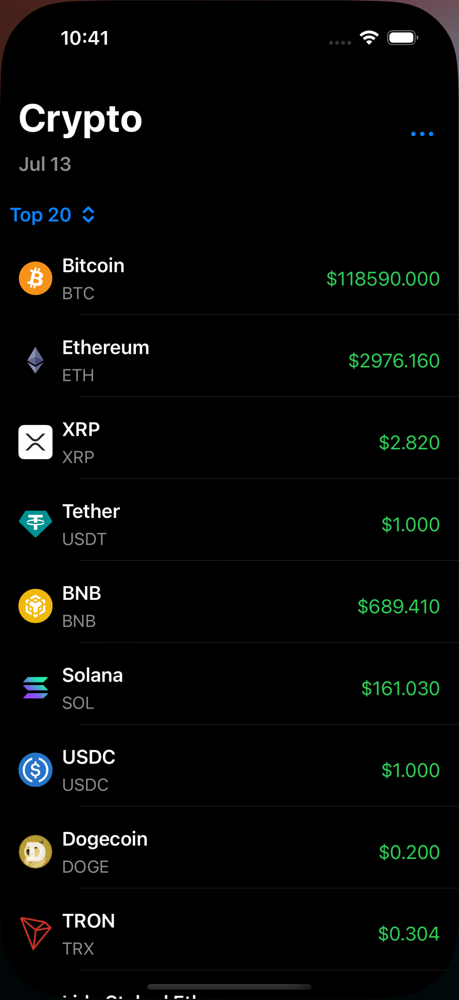
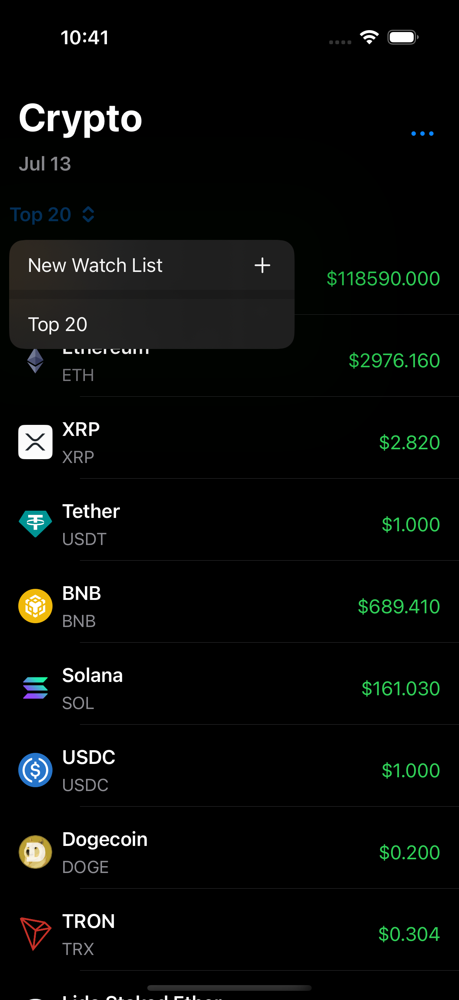
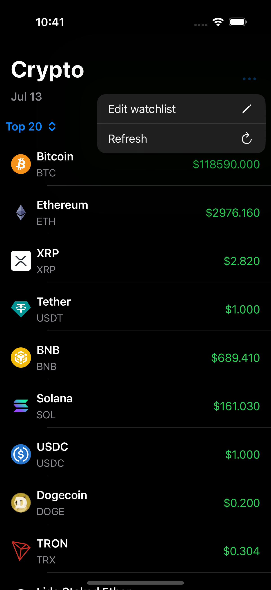
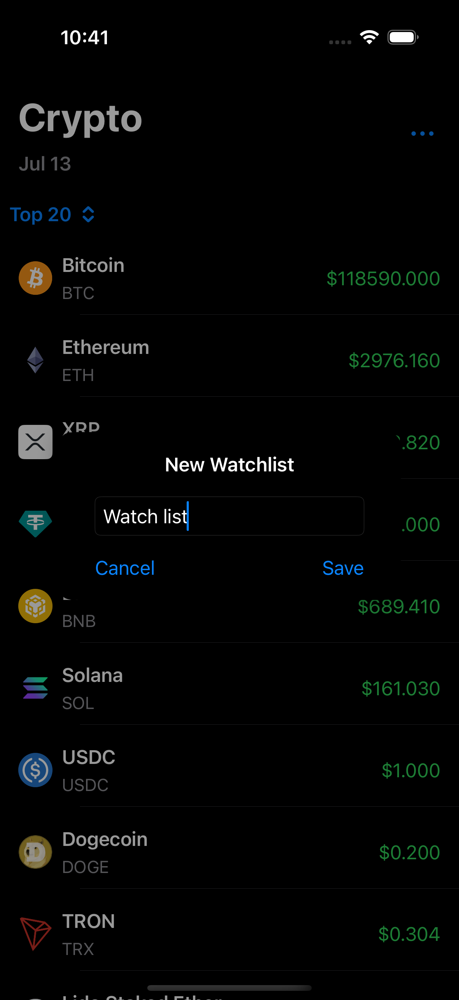
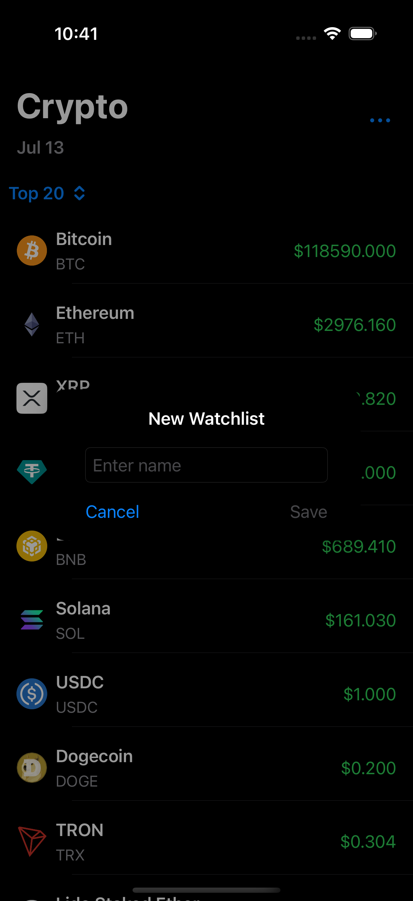
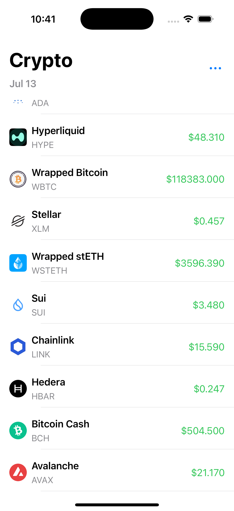
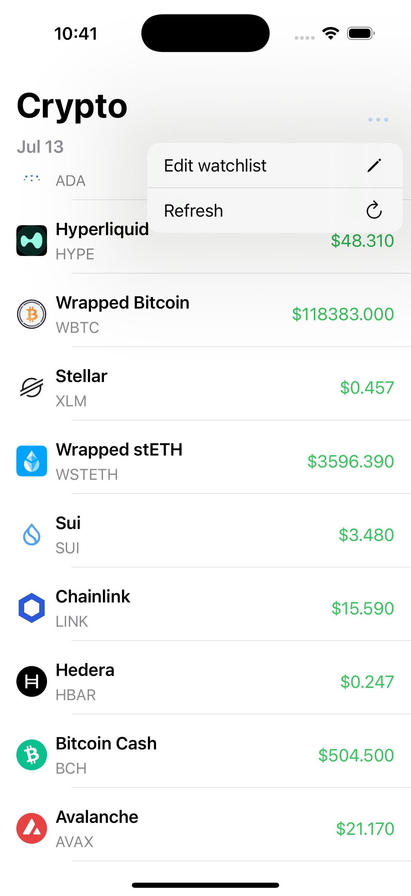
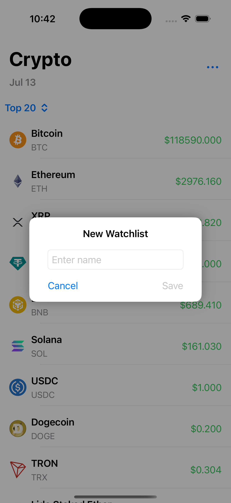
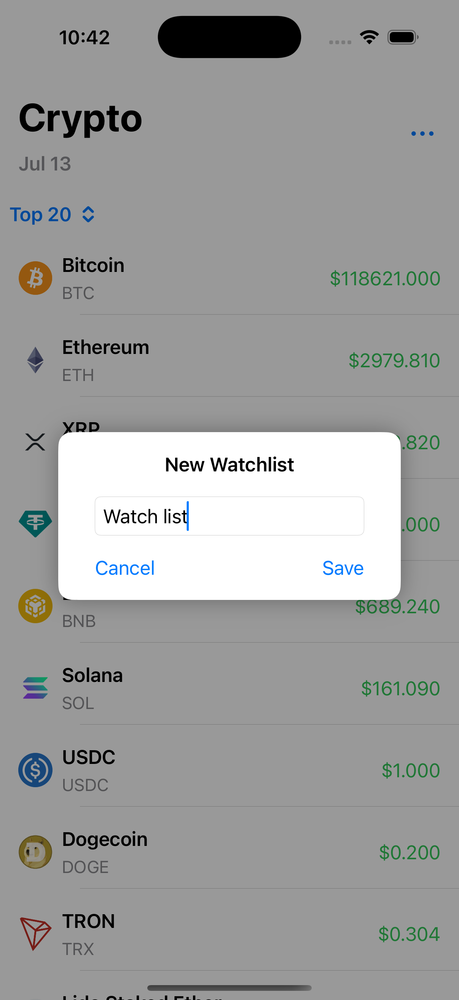
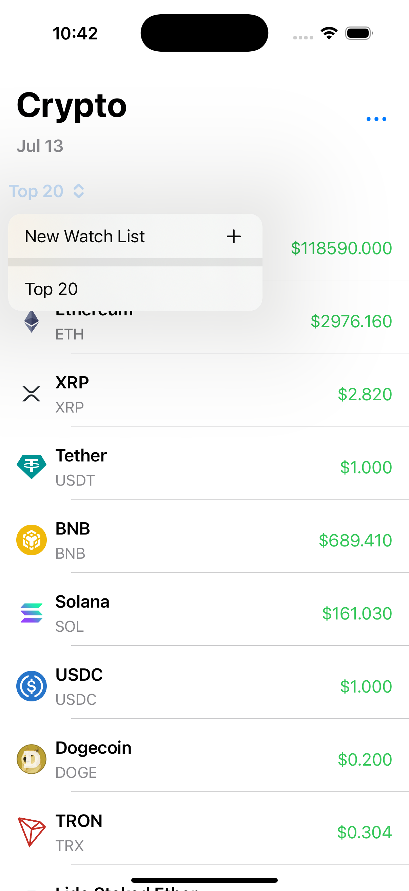

Here’s an **updated and complete `README.md`** that combines your detailed project structure with the **assignment-specific context**, **feature list**, and **setup info** — tailored for submission or review.

---


# 🚀 Crypto Price Tracker (iOS)

A simple cryptocurrency tracking app built using **Swift** and **SwiftUI**, designed as a take-home assessment. The app displays real-time prices of top coins and allows users to maintain a watchlist. It emphasizes modular architecture and clean code practices.

---

### 📸 UI Screenshots

#### 🌙 Dark Mode

|                            |                            |                           |                         |                          |
| ----------------------------- | ----------------------------- | ----------------------------- | ----------------------------- | ----------------------------- |
|  |  |  |  |  |
|   |   |   |   |   |

#### ☀️ Light Mode

|                             |                             |                            |                            |                           |
| ------------------------------ | ------------------------------ | ------------------------------ | ------------------------------ | ------------------------------ |
|  |  |  |  |  |
|   |   |   |   |   |
 
---

## 📱 Features

### ✅ Core Functionality
- 🔁 **Live Price List**: Fetches and displays top 20 cryptocurrencies from CoinGecko
- 💰 **Displays**: Name, symbol, and current price (USD)
- ⭐️ **Watchlist (Partial)**: UI and persistence logic scaffolded (add/remove not fully wired)
- 🔄 **Auto-refresh**: Coin data refreshes every 60 seconds in the background

### 💡 Enhancements
- 🧠 **MVVM + Coordinator Architecture**
- 📁 Modular folder structure
- ⌛️ Loading states (`.loading`, `.error`, `.loaded`)
- 📲 Reusable UI components like TileView, Alerts, CachedImage

---


## 🧭 Project Structure
```
Crypto Price Tracker
├── Core
│   ├── Coordinator         # App navigation logic
│   ├── Extension           # Swift extensions
│   ├── Factory             # ViewModel and ViewController creators
│   ├── Networking          # API, Error, Logger, Reachability
│   ├── SceneSetup.swift    # Scene lifecycle
│   └── Shared              # Reusable UI components
│
├── Modules
│   └── Home
│       ├── Coordinator     # CryptoListingCoordinator
│       ├── Networking      # CoinGecko services + models
│       ├── Presentation    # View model transformers
│       ├── Screens         # Main screen (UIKit)
│       ├── Subview         # CryptoNavigationBar, TileView
│       └── ViewModel       # Business logic (CryptoListingViewModel)
│
├── Resources               # Asset catalog, icons
├── Supporting              # AppDelegate, Info.plist, LaunchScreen
└── README.md

````

---

## ⚙️ Tech Stack

| Layer        | Technology      |
|--------------|-----------------|
| UI           | SwiftUI         |
| Architecture | MVVM + Coordinator |
| Networking   | URLSession (async/await) |
| Persistence  | UserDefaults (watchlist) |
| API          | [CoinGecko API](https://www.coingecko.com/) |

---

## 📦 How to Run

1. Clone this repository:
```bash
   git clone https://github.com/your-username/crypto-price-tracker.git
```

2. Open the project:
```bash
   open "Crypto Price Tracker.xcodeproj"
```

3. Build & run:

   * Select a simulator
   * Press `Cmd + R` to run

---

## 🚧 Assumptions & Shortcuts

* ⏱ Time-limited to \~3 hours; some features are scaffolded but not fully complete
* ⭐️ Watchlist toggle is partially implemented — logic for persistence and toggle is in `ViewModel`, but UI isn’t fully hooked up yet

---

## 📊 Project Assessment

| Criteria                 | Result                                      |
| ------------------------ | ------------------------------------------- |
| Core functionality       | ✅ 80% (watchlist pending)                   |
| Code quality & structure | ✅ MVVM, modular, testable                   |
| UX polish                | ✅ Smooth layout, basic error/loading states |
| Documentation            | ✅ This README, clean folder structure       |


---

## 📬 Contact

Feel free to fork, suggest improvements, or contact me:

* **Name:** Abhishek kapoor
* **Email:** [abhikapoor2000.ak@gmail.com](mailto:abhikapoor2000.ak@gmail.com)
* **Phone Number:** [+91 77427 55223](tel://917742755223)
---
